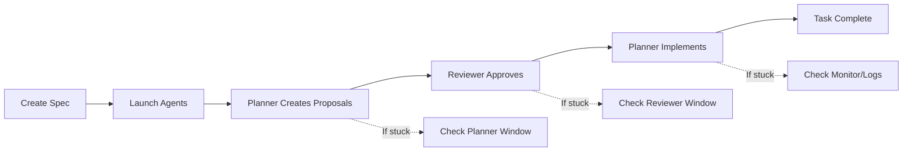

# 🚀 Agent System - Quick Reference

## Your Current Setup

```bash
Project: /Users/mchaouachi/IdeaProjects/StockMonitor
Agent System: /Users/mchaouachi/agent-system/
Current Task: 999-fix-remaining-tests (75 tests to fix)
```

---

## 🎯 Common Use Cases

### 1️⃣ Start Fresh Test Fixing (Like We Just Did)

```bash
# Reset everything
echo '{}' > /Users/mchaouachi/IdeaProjects/StockMonitor/coordination/task_proposals.json

# Launch agents
cd /Users/mchaouachi/agent-system
./launch-agents-from-spec.sh /Users/mchaouachi/IdeaProjects/StockMonitor 999

# What happens:
# 1. Planner creates proposals → 2-3 minutes
# 2. Reviewer approves → 1-2 minutes  
# 3. Planner implements → varies
```

### 2️⃣ Create New Feature Implementation

```bash
# Create spec for new feature
mkdir -p /Users/mchaouachi/IdeaProjects/StockMonitor/specs/001-user-dashboard

cat > /Users/mchaouachi/IdeaProjects/StockMonitor/specs/001-user-dashboard/spec.md << 'EOF'
# Feature Specification: User Dashboard

## Task
Create a dashboard showing stock portfolio performance.

## Requirements
- Display total portfolio value
- Show daily gain/loss
- List top 5 performers
- Add refresh button
- Mobile responsive

## Success Criteria
- Loads in under 2 seconds
- Updates every 30 seconds
- Works on mobile
- Shows accurate data

## Implementation Notes
Use existing StockService. Work autonomously.
EOF

# Launch agents
./launch-agents-from-spec.sh /Users/mchaouachi/IdeaProjects/StockMonitor 001
```

### 3️⃣ Resume Interrupted Work

```bash
# Check where we left off
cat /Users/mchaouachi/IdeaProjects/StockMonitor/coordination/task_proposals.json | grep status

# If status is "approved" but not implemented:
tmux attach -t agent_system_spec
# Go to planner (Ctrl+b 0) and restart Claude if needed

# If status is "awaiting_review":
tmux attach -t agent_system_spec  
# Go to reviewer (Ctrl+b 1) and check if it's reviewing

# If agents died, just restart:
./launch-agents-from-spec.sh /Users/mchaouachi/IdeaProjects/StockMonitor 999
```

### 4️⃣ Monitor Progress Real-Time

```bash
# Quick status check
tmux attach -t agent_system_spec
# Ctrl+b 2 for monitor window

# Or in new terminal:
watch -n 2 'cat /Users/mchaouachi/IdeaProjects/StockMonitor/coordination/task_proposals.json | python3 -m json.tool | head -20'

# Check test progress specifically
cd /Users/mchaouachi/IdeaProjects/StockMonitor
mvn test | grep "Tests run"
```

### 5️⃣ Debug When Stuck

```bash
# If Planner not creating proposals:
tmux send-keys -t agent_system_spec:planner C-c  # Stop current
tmux send-keys -t agent_system_spec:planner "claude" Enter
sleep 3
tmux send-keys -t agent_system_spec:planner "Read /Users/mchaouachi/agent-system/prompts/planner_agent_spec.txt and /Users/mchaouachi/IdeaProjects/StockMonitor/specs/999-fix-remaining-tests/spec.md. Create proposals in /Users/mchaouachi/IdeaProjects/StockMonitor/coordination/task_proposals.json" Enter

# If Reviewer not approving:
tmux send-keys -t agent_system_spec:reviewer C-c
tmux send-keys -t agent_system_spec:reviewer "claude" Enter
sleep 3
tmux send-keys -t agent_system_spec:reviewer "Read /Users/mchaouachi/IdeaProjects/StockMonitor/coordination/task_proposals.json and approve best approach with status: approved" Enter
```

---

## 📊 Enable Chat History Logging

```bash
# Download and run logging setup
chmod +x setup-logging.sh
./setup-logging.sh /Users/mchaouachi/IdeaProjects/StockMonitor

# View logs afterward
tail -f /Users/mchaouachi/IdeaProjects/StockMonitor/coordination/logs/combined/agent_history.log

# See Claude conversations
cat /Users/mchaouachi/IdeaProjects/StockMonitor/coordination/logs/combined/claude_conversations.log

# Interactive log viewer
./view-logs.sh /Users/mchaouachi/IdeaProjects/StockMonitor
```

---

## 🗂️ Your Spec Structure

```
/Users/mchaouachi/IdeaProjects/StockMonitor/
├── specs/
│   ├── 001-feature-name/
│   │   └── spec.md        # Feature specs
│   ├── 002-another-feature/
│   │   └── spec.md
│   └── 999-fix-remaining-tests/
│       └── spec.md        # Current test fixing
└── coordination/
    ├── task_proposals.json     # Current proposals/status
    ├── active_work_registry.json
    └── logs/
        ├── planner/           # Planner sessions
        ├── reviewer/          # Reviewer sessions
        └── combined/          # All activity
```

---

## ⚡ Quick Commands

| Action | Command |
|--------|---------|
| **Start new task** | `./launch-agents-from-spec.sh /Users/mchaouachi/IdeaProjects/StockMonitor 001` |
| **Resume current** | `tmux attach -t agent_system_spec` |
| **Check status** | `cat coordination/task_proposals.json \| grep status` |
| **View planner** | `Ctrl+b 0` (in tmux) |
| **View reviewer** | `Ctrl+b 1` (in tmux) |
| **View monitor** | `Ctrl+b 2` (in tmux) |
| **Kill all** | `tmux kill-session -t agent_system_spec` |
| **Reset state** | `echo '{}' > coordination/task_proposals.json` |

---

## 🔄 Typical Workflow



1. **Create spec.md** with clear requirements
2. **Launch agents** with spec number
3. **Monitor progress** in tmux windows
4. **Check logs** if something goes wrong
5. **Task completes** autonomously

---

## 💾 Backup Your Work

```bash
# Before starting major task
cp -r /Users/mchaouachi/IdeaProjects/StockMonitor /Users/mchaouachi/IdeaProjects/StockMonitor.backup

# Save agent state
cp coordination/task_proposals.json coordination/task_proposals.backup.json

# Archive logs
tar -czf logs_$(date +%Y%m%d).tar.gz coordination/logs/
```

---

## 🆘 Troubleshooting

**"Command too long"**
- Already fixed! Using file-based approach

**"Claude not responding"**
- Check: `echo "test" | claude`
- May need: `claude auth`

**"Proposals not created"**
- Check planner window: `Ctrl+b 0`
- Restart Claude in that window

**"Not approving"**
- Check reviewer window: `Ctrl+b 1`  
- Manually approve if needed

**"Can't find spec"**
- Check path: `ls /Users/mchaouachi/IdeaProjects/StockMonitor/specs/`
- Create if missing

---

## 📝 Example Specs You Can Create

### Bug Fix
```bash
# specs/100-fix-null-pointer/spec.md
Task: Fix NullPointerException in StockService.getPrice()
Success: No NPE, proper error handling
```

### Performance
```bash
# specs/200-optimize-queries/spec.md
Task: Optimize database queries taking >1s
Success: All queries under 100ms
```

### Feature
```bash
# specs/003-email-alerts/spec.md
Task: Add email alerts for price changes >5%
Success: Emails sent within 1 minute of change
```

---

Remember: The agents work best with clear, specific specs. Always include "Work autonomously" in your specs!
