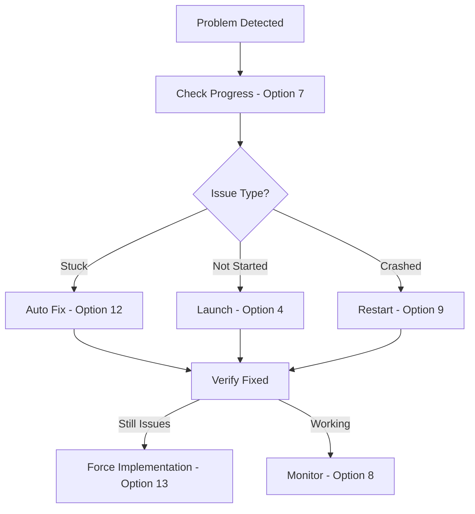

# 🚀 Agent System Command Center - Start Here!

## Overview

The **start-here.sh** script is your central command center for managing the entire agent system. It provides a menu-driven interface to all available scripts, organized by function with clear descriptions.

---

## ⚡ Quick Start

### Installation
```bash
# 1. Download all files to a directory
cd /path/to/downloaded/files

# 2. Run the installer
chmod +x install.sh
./install.sh

# 3. Navigate to agent system
cd /Users/mchaouachi/agent-system

# 4. Launch the command center
./start-here.sh
```

---

## 📋 Menu Structure

### Main Categories

1. **Setup & Initialization** (Options 1-3)
   - Initialize projects
   - Quick start wizard
   - Create test specs

2. **Launch Agents** (Options 4-6)
   - Launch with specs
   - Standard launch
   - Strict mode

3. **Monitoring & Debugging** (Options 7-11)
   - Check progress
   - Live monitoring
   - View logs
   - Quick management

4. **Fixing & Recovery** (Options 12-18)
   - Auto-fix issues
   - Force implementations
   - Emergency stops

5. **Utilities** (Options 19-21)
   - Documentation
   - Configuration
   - Custom commands

---

## 🎯 Common Tasks

### First Time Setup
```
1. Start menu: ./start-here.sh
2. Select: 1 (Setup Project)
3. Enter: /Users/mchaouachi/IdeaProjects/StockMonitor
4. Select: 4 (Launch From Spec)
5. Enter: 999 (for test fixing)
```

### Check What's Happening
```
1. Start menu: ./start-here.sh
2. Select: 7 (Check Progress)
   Shows complete status with recommendations
```

### Fix Stuck Agents
```
1. Start menu: ./start-here.sh
2. Select: 12 (Auto Fix)
   Automatically diagnoses and fixes issues
```

### Quick Fix Without Menu
```bash
# Direct commands (no menu needed):
./agent-manager.sh check    # Quick status
./agent-manager.sh fix      # Auto-fix
./agent-autofix.sh          # Full diagnostic
```

---

## 🔧 Key Scripts Explained

### Priority 1 - Most Used
- **start-here.sh** - Main menu interface
- **agent-autofix.sh** - Intelligent problem solver
- **check-agent-progress.sh** - Full status report
- **agent-manager.sh** - Quick management tool

### Priority 2 - Launch & Monitor
- **launch-agents-from-spec.sh** - Main launcher
- **monitor.sh** - Live dashboard
- **view-logs.sh** - Log browser

### Priority 3 - Fixes
- **force-implementation.sh** - Force start
- **start-implementation.sh** - Simple starter
- **stop-agents.sh** - Emergency stop

---

## 📊 Status Meanings

| Status | Meaning | Action Needed |
|--------|---------|--------------|
| **idle** | Nothing happening | Launch agents |
| **awaiting_review** | Proposals created | Wait or force review |
| **approved** | Ready to implement | Should start automatically |
| **implementing** | Working on tests | Let it run |

---

## 🚨 Troubleshooting Flow



---

## 💡 Pro Tips

### Efficiency Tips
1. **Use option 7 first** - Always check progress before fixing
2. **Option 12 solves most issues** - Auto-fix is intelligent
3. **Don't restart unnecessarily** - Try fixes first
4. **Let agents work** - Don't interrupt when implementing

### Keyboard Shortcuts (in menu)
- **0** - Exit immediately
- **Enter** - Accept defaults
- **Ctrl+C** - Cancel current operation

### Direct Commands (skip menu)
```bash
# Most common operations without menu:
./agent-manager.sh check           # Status
./agent-autofix.sh                 # Fix issues
./check-agent-progress.sh          # Full report
tmux attach -t agent_system_spec   # Watch agents
```

---

## 📁 File Locations

### Scripts
```
/Users/mchaouachi/agent-system/
├── start-here.sh          # Main menu
├── *.sh                   # All scripts
└── prompts/              # Agent instructions
```

### Project Files
```
/Users/mchaouachi/IdeaProjects/StockMonitor/
├── specs/                 # Task specifications
│   └── 999-fix-remaining-tests/spec.md
└── coordination/         # Agent state
    ├── task_proposals.json
    └── logs/
```

---

## 🔄 Typical Workflow

1. **Morning Start**
   ```
   ./start-here.sh → Option 7 (Check Progress)
   ```

2. **If Stuck**
   ```
   ./start-here.sh → Option 12 (Auto Fix)
   ```

3. **Monitor Work**
   ```
   ./start-here.sh → Option 8 (Monitor)
   ```

4. **End of Day**
   ```
   ./start-here.sh → Option 20 (Show Paths)
   Note the status for tomorrow
   ```

---

## ⚙️ Configuration

The menu uses these defaults:
- Project: `/Users/mchaouachi/IdeaProjects/StockMonitor`
- Agent System: `/Users/mchaouachi/agent-system`

To change defaults, edit start-here.sh:
```bash
DEFAULT_PROJECT="/your/project/path"
DEFAULT_AGENT_SYSTEM="/your/agent/path"
```

---

## 📝 Documentation Access

From the menu:
- **Option 19** - View all documentation
- **Option 20** - Show configuration

Available docs:
- COMPLETE_DOCUMENTATION.md - Everything
- QUICK_REFERENCE.md - Commands
- SCRIPT_REFERENCE.md - Script details

---

## 🆘 Emergency Commands

If everything is broken:
```bash
# Kill everything
tmux kill-server

# Reset state
echo '{}' > /Users/mchaouachi/IdeaProjects/StockMonitor/coordination/task_proposals.json

# Fresh start
./start-here.sh → Option 4 (Launch From Spec)
```

---

## 📞 Getting Help

1. Check documentation (Option 19)
2. View script reference (SCRIPT_REFERENCE.md)
3. Check logs (Option 10)
4. Run diagnostics (Option 7)

---

## 🎉 You're Ready!

Run `./start-here.sh` and you have everything at your fingertips!

Remember: **Option 7** (Check Progress) and **Option 12** (Auto Fix) solve most problems.
